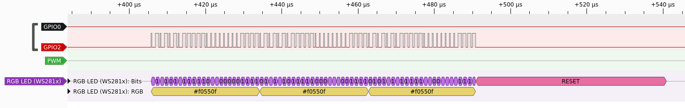

# Use the PIO as an internal logic analyzer

This crates uses one of the PIOs and the DMA engine to implement a simple
logic analyzer. The state of the GPIO pins is continously monitored. Every
change is logged with a timestamp into a memory buffer.

A helper function is provided to print the memory buffer in 
[VCD format](https://en.wikipedia.org/wiki/Value_change_dump)
to a [Write instance](https://doc.rust-lang.org/nightly/core/fmt/trait.Write.html).

## Example

```
cargo embed --example=ws2812
```

`cargo embed` is configured to write log files, so after exiting(!),
`ws2812_RP2040_<timestamp>_channel1.txt` contains a VCD dump which can
be visualized using [Pulseview](https://www.sigrok.org/wiki/Pulseview):



## Usage

Wrap the code segment to monitor:

```
    use rp2040_pio_logic_analyzer as probe;

    let mut dma_buf = [0u32; 8192];
    probe::run_with_logic_analyzer(pac.PIO1, pac.DMA, &mut pac.RESETS, &mut dma_buf, || {
       // some code which uses GPIO pins
    });
    probe::write_dma_buffer(&mut write, &dma_buf[..]);
```

## License

This project is licensed under either of

- Apache License, Version 2.0 ([LICENSE-APACHE](LICENSE-APACHE) or
  http://www.apache.org/licenses/LICENSE-2.0)

- MIT license ([LICENSE-MIT](LICENSE-MIT) or http://opensource.org/licenses/MIT)

at your option.
